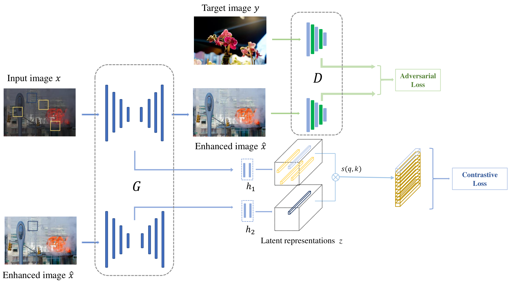

# Learning Deep Representations for Photo Retouching 
By [Di Li](https://scholar.google.com/citations?user=r6WfS2gAAAAJ), and [Susanto Rahardja](https://scholar.google.com/citations?user=OdkA4jMAAAAJ&hl=en) 

## Introduction

The codebase provides the official PyTorch implementation for the paper ["Unsupervised Image Enhancement via Contrastive Learning"](https://ieeexplore.ieee.org/abstract/document/10558284) (accepted by 2024 IEEE International Symposium on Circuits and Systems (ISCAS)).

<p align="center">
  
</p>

In this project, we present a contrastive loss to ensure that the content remains consistent across multiple scales in both input and output representations. In addition, we propose a multi-scale discriminator to strengthen the adversarial learning. Extensive experiments conducted in this paper showed that our algorithm achieved state-of-the-art performance on MIT-Adobe-FiveK dataset both quantitively and qualitatively.

## Dependencies 

- Python 3 (Recommend to use [Anaconda](https://www.anaconda.com/download/#linux))
- [PyTorch >= 1.0](https://pytorch.org/)
- Opencv
- Imageio
- [visdom](https://github.com/facebookresearch/visdom)

## Datasets

The paper use the [FiveK](https://data.csail.mit.edu/graphics/fivek/) dataset for experiments.

- FiveK : You can download the original FiveK dataset from the dataset [homepage](https://data.csail.mit.edu/graphics/fivek/) and then process images using Adobe Lightroom.
  - To generate the input images, in the Collections list, select the collection Input `with Daylight WhiteBalance minus 1.5`.  
  - To generate the target images, in the Collections list, select the collection `Experts/C`.  
  - All the images are converted to `.PNG` format.

The final directory structure is as follows.

```
./data/FiveK
    trainA/         # 8-bit sRGB train inputs
    trainB/         # 8-bit sRGB train groundtruth
    testA/          # 8-bit sRGB test inputs
    testB/          # 8-bit sRGB test groundtruth
```
## Train
- run visdom to monitor status
```
visdom
```
- run
```bash
python train.py --name UIECL --dataroot ./data/FiveK --batch_size 2 --gpu_ids 0 --netG rdnccut --model cut --lambda_NCE 10 --nce_includes_all_negatives_from_minibatch --ndf 32 --netD fe --niter 20 --niter_decay 80 --spectral_norm --patch_N 3 --patchSize 64
```

## Test
- run
```bash
python test.py --dataroot ./data/FiveK/testA --name UIECL --gpu_ids 0 --netG rdnccut 
```

## Citation
If you find this repository useful, please kindly consider citing the following paper:

```BibTeX
@inproceedings{li2024unsupervised,
  title={Unsupervised Image Enhancement via Contrastive Learning},
  author={Li, Di and Rahardja, Susanto},
  booktitle={2024 IEEE International Symposium on Circuits and Systems (ISCAS)},
  pages={1--5},
  year={2024},
  organization={IEEE}
}
```

## License

Our project is licensed under a [MIT License](LICENSE).